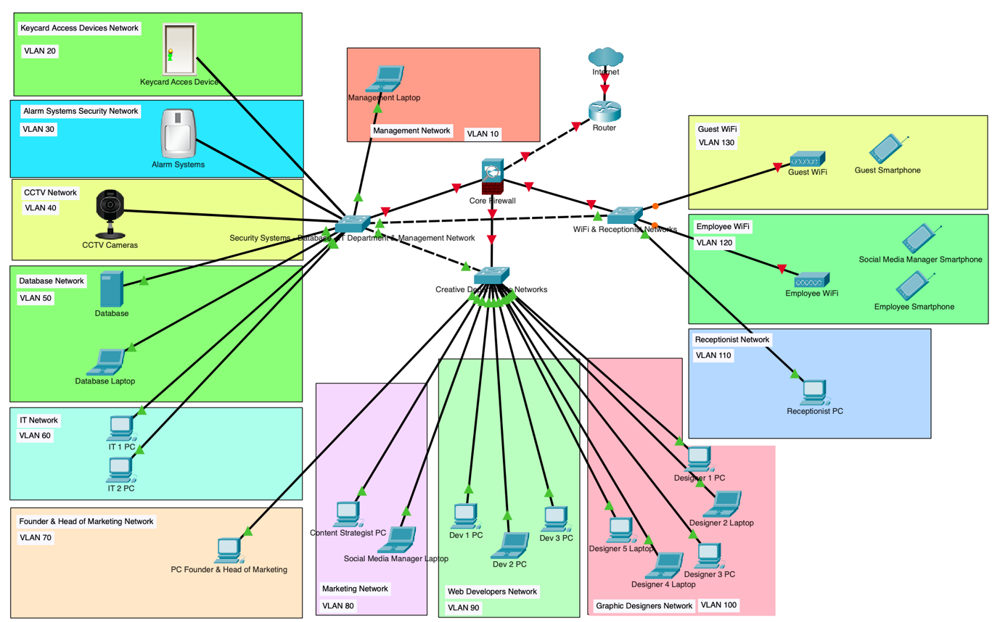
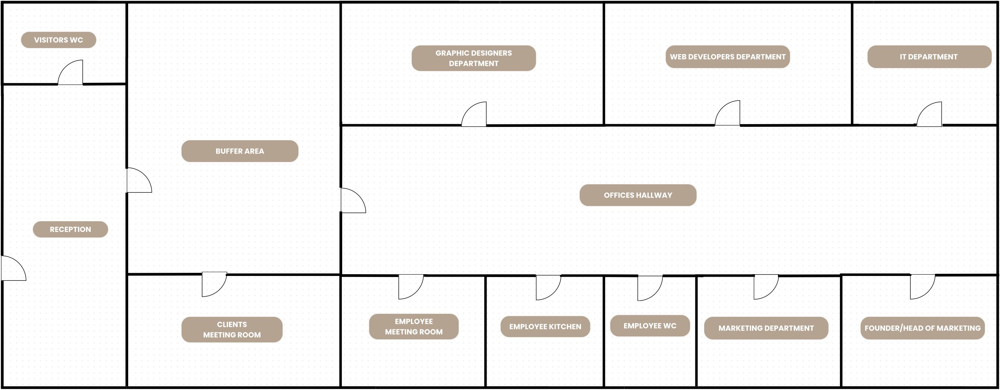
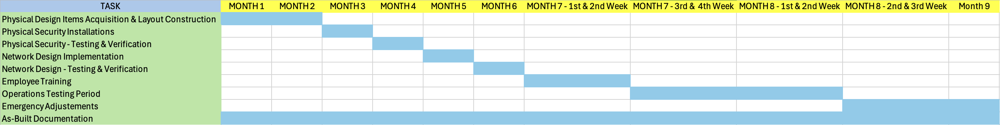

# Office Security Plan & Network Segmentation

A physical and network security plan for **Onya**, a fictional 12-person creative agency that handles sensitive client data: website credentials, social media accounts, analytics and original brand files.

The plan covers the office layout and physical access control, a segmented network with 13 VLANs behind a core firewall, identity and access policies, a 9-month implementation schedule, and the testing and assurance methods that keep the environment secure after go-live.

> **Scope:** this is a **design and planning** project. The network topology was laid out in Cisco Packet Tracer to show the devices, segments and connections, but the devices were not configured: no IP addressing, VLAN or firewall configuration is applied in the file. The VLANs, access rules and security controls below are the proposed design. For a fully configured Packet Tracer network, see [enterprise-network-design](https://github.com/GAslanidis/enterprise-network-design).



## What Needed Protecting

- **Client data:** marketing analytics, reports and original brand files
- **Credentials:** WordPress admin accounts, GitHub and social media passwords, employee logins
- **Internal files:** HR, finance and employee records
- **The company database** and the employees' LAN

## Physical Security



- **Zoned layout.** Visitors only reach the reception, a buffer area, a client meeting room and a visitors' WC. A keycard door keeps them out of the office hallway.
- **Keycard access control.** Employees open the hallway with their card. The IT department (server room and database) and the founder's office need their own special keycards.
- **4 CCTV cameras** covering the entrance, reception, buffer area and office hallway. Only IT and the founder can view the footage, which is kept for 48 hours.
- **Alarm system** with motion and door sensors, monitored around the clock by an outsourced security company.
- **UPS** that keeps the router, switches, firewall, cameras, alarm and keycard system running during a power cut.

## Network Design

The proposed network uses a **star topology**: a core firewall sits between the internet router and three switches (security systems and IT, creative departments, and Wi-Fi and reception). Every group of devices is assigned its own VLAN:

| VLAN | Network | VLAN | Network |
|---|---|---|---|
| 10 | Management | 80 | Marketing |
| 20 | Keycard access devices | 90 | Web developers |
| 30 | Alarm system | 100 | Graphic designers |
| 40 | CCTV | 110 | Receptionist |
| 50 | Database | 120 | Employee Wi-Fi |
| 60 | IT department | 130 | Guest Wi-Fi |
| 70 | Founder & Head of Marketing | | |

**Access rules**
- Departments can't reach each other's networks unless they share resources.
- The **Management network** (run by IT) controls the CCTV, alarm and keycard networks and is used to detect threats and isolate compromised segments. Other networks can't reach it.
- The **founder's network** has access to the CCTV.
- **Guest Wi-Fi** is fully separate from the internal network. **Employee Wi-Fi** needs a personal login and blocks file uploads and downloads, except for approved services such as Google Workspace and the social media tools the marketing team needs.

**Security controls**
- Core firewall (Fortinet FortiGate 60F suggested) for packet inspection, threat protection and VLAN isolation, with VPN support for future remote work
- **Multi-factor authentication** on all user accounts
- **Least-privilege** access, with permissions based on each employee's role
- Encryption for stored and transmitted data
- Automated backups of design files, development files and client data
- Regular system updates and **patch management**
- **Phishing and security-awareness training** for all staff

## Implementation Plan



| Phase | Months | Work |
|---|---|---|
| Physical security | 1 – 4 | Buy equipment, build the new layout, install CCTV, keycards, alarm, UPS, core router and firewall, then test everything |
| Network security | 5 – 6 | Install workstations, configure VLANs and firewall rules, create role-based accounts with MFA, set up the database and automated backups, then run penetration, firewall, backup and failover tests |
| Training and live testing | 7 – 8 | Two weeks of staff training, then a month of normal operation with monitoring on site |
| Buffer and handover | 8 – 9 | Time reserved for fixes, plus final as-built documentation |

The **as-built documentation** runs through the whole project and is finalised at the end. It includes physical and logical topology maps, device configurations and IP assignments, firewall and VLAN rules, and an access-control map of what each role can reach.

## Testing & Assurance

**During the live testing period**
- Keycard permissions, CCTV coverage and recording quality, alarm response, and controlled power cuts to test the UPS
- VLAN separation, firewall rule enforcement, backup automation and account security

**Ongoing, after handover**

| Check | How often |
|---|---|
| Vulnerability scans | Monthly |
| Backup restore tests | Monthly |
| Firewall and segmentation review | Regularly, as the company changes |
| CCTV and alarm checks | Weekly |
| UPS tests | Every 6 months |
| Security-awareness refresher training | Yearly |

## Project Structure

```
├── README.md
├── office-network.pkt                       # Cisco Packet Tracer topology (layout only, not configured)
└── docs/
    ├── office-security-plan.pdf             # full report
    ├── network-diagram.png
    ├── floor-plan.png
    ├── gantt-chart.png
    └── gantt-timeline.xlsx                  # implementation schedule
```

To view the topology, install [Cisco Packet Tracer](https://www.netacad.com/cisco-packet-tracer), which is free with a Cisco Networking Academy account, and open `office-network.pkt`.

## Author

George Aslanidis
